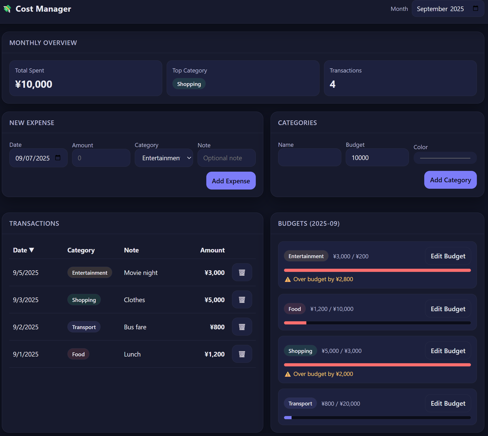

## About
- This is cost management app.
- Manage your cost, expenses, and fee for food, transportation, entertainment, etc.

## Tech stack
- **Frontend**: React, TypeScript, Vite, Styled-components
- **Backend**: Spring-boot, Maven
- **Database**: MySQL, Docker
- **Infrastructure**: Ubuntu, Nginx

## Preview
[Preview(Youtube)](https://youtu.be/MAje1Xx7u4U?si=fnvqBZUUvIVdSz8l)

## Demo site
[Demo site(https://cm.shelner.com)](https://cm.shelner.com)

## Demo Image

